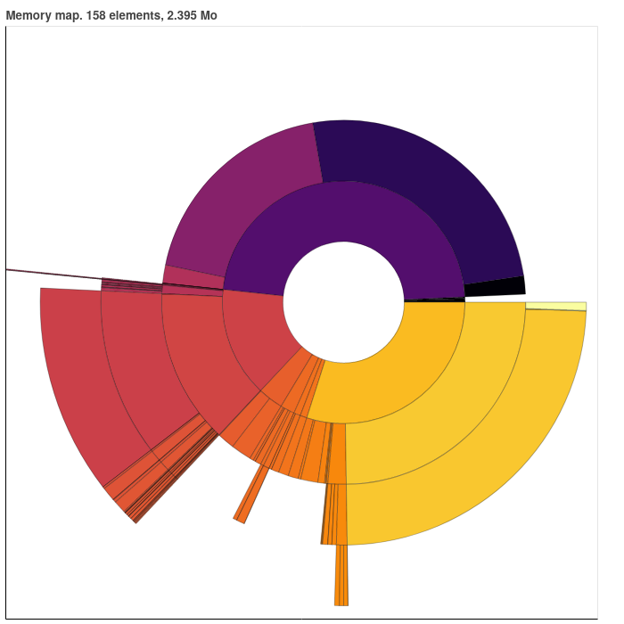

# Baobab for `neocli`


How to know which part of your website consume the most memory ?

This tool is similar to the [linux baobab tool](https://doc.ubuntu-fr.org/baobab),
to the difference that we feed it with a file.





# Usage

Simply `bokeh_baobab <my_size_file.json>`.

The given file must be a list of dictionaries, with general keys:

```json
{
"path": string,
"is_directory": bool
}
```

and the additional key `"size": int` if `is_directory=True`.


The result will be saved into an `html/` folder.
For the moment, name of the generated file is not customisable.
It would be `html/Map_<my_size_file>.html`


## Special commands


### Scope 

If the file is the description of your website architecture, you may want to look at a specific folder.
As an example, if my file describe:

```
img/
    cat.png
    dog.png
    
src/
    my_script_1.py
    my_script_2.py

readme.md
```

I can ask to explore only directory `img/`.

My command would be `bokeh_baobab <my_size_file.json> --sub_path="img"`. (NB: don't add the final `/`)

### Depth limit

If the depth is very deep, you may want to limit to the first levels only.
For this purpose, you only need to add to the main command `--lvl=xx` where `xx` is your maximum depth of interest.


# Getting files

## Neocli

The script is designed to work with `neocli` outputs.

To create a snapshot, launch `./neocli size --save`.
This would save the snapshot into the `snapshots/` folder, creating `latest.json` and `T_<epoch_time>.json`.

Going back into the baobab folder (`cd baobab`), run:

`./bokeh_baobab.py ../snapshots/latest.json`


## Test on your local folders

Maybe you don't use `neocities`, so you have no interest on using the CLI.

Instead, you can use the `tree.py` script, that will generate compatible file from a folder.
So you could use it on a website developped locally.

`./tree.py --path=<my_path_to_explore>`

For instance: `./tree.py --path="."`

Or `./tree.py --path="../images"`

By default, the information will be save into `tree.json`.
You can customize the location by adding `--save_path=<my_desired_file_name.json>` to the command.


# TODO

- [ ] Improve coloring method
- [ ] Customizable html name
- [ ] Depth regularization when going into the tree
